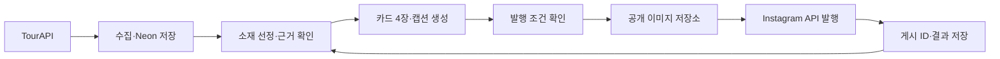

# 주말픽 — 인스타그램 피드 자동화 계획

작성일: 2026-09-11

상태: 방향 전환 계획. 현재 구현은 웹 MVP와 TourAPI 수집 코드까지이며, 카드 생성·인스타그램 연결·자동 발행은 앞으로 구현한다. 이 문서 작성으로 계정 연결, 배포, 실제 게시는 실행하지 않는다.

기존 웹 기획은 [PLAN.web-archive.md](PLAN.web-archive.md)에 보관한다. 현재 코드 실행법은 [README.md](README.md), 기존 검증 기록은 [VALIDATION.md](VALIDATION.md)를 참고한다. 앞으로 개발할 범위는 이 문서를 기준으로 한다.

## 1. 목표와 첫 운영 범위

**공식 API로 수도권 나들이 정보를 수집하고, 매일 하나의 추천을 카드 이미지와 캡션으로 만들어 인스타그램에 발행한다.**

주말 약속을 정하는 커플·친구가 게시물을 보고 갈 곳을 고르고, 저장하거나 동행에게 공유하는 계정을 만든다. 편집의 중심은 “왜 지금 여기를 가면 좋은가”와 “방문 전에 무엇을 알아야 하는가”다.

| 항목 | 시작 기준 |
|---|---|
| 계정 | 직접 운영하는 주말픽 프로페셔널 계정 1개 |
| 지역 | 서울·경기·인천. 실제 소재가 충분한 지역부터 시작 |
| 소재 | 축제·문화행사·전시와 주변 관광지·문화시설 |
| 게시 단위 | 메인 행사 1개를 소개하는 4장 캐러셀과 캡션 |
| 빈도 | 한국 시간 기준 하루 최대 1개. 검증된 소재가 없으면 건너뛴다 |
| 발행 시각 | 매일 19:17 KST를 초기 실험값으로 사용. 최적 시간이라는 가정은 하지 않는다 |
| 첫 운영 | 14일간 초안 확인 후 예약 발행. 품질 기준 충족 후 자동 발행으로 전환 |
| 첫 성과 | 운영 소요시간, 저장·공유 반응, 팔로워 순증을 확인 |

웹의 신규 사용자 기능 개발은 보류한다. 기존 수집·DB·날짜 처리 코드를 활용한다. 전국 확대, 다중 계정, 릴스, 자동 댓글·DM, 예약·결제, 별도 관리 웹은 첫 버전 범위에 넣지 않는다.

## 2. 현재 자산과 보완할 부분

| 기존 코드 | 활용 방법과 추가 작업 |
|---|---|
| `src/lib/tour-api.ts` | 행사·주변 장소 수집, 호출 예산, 제한적 재시도를 재사용. 게시 후보의 상세 재확인과 이미지 이용 조건의 구조화 필드를 추가 |
| `src/lib/database.ts`, `db/001_initial.sql` | Neon 저장소와 수집 이력을 재사용. 게시 상태·발행 결과를 저장하는 테이블 추가 |
| `src/lib/domain.ts` | KST 날짜·거리 계산·기본 추천을 재사용. 발행일과 방문일 구분, 게시 이력에 따른 제외 규칙 추가 |
| `scripts/sync.ts` | 예약 실행에서도 기존 `data:sync` 명령 사용 |
| `tokens.css`, 설치된 한글 서체 | 카드의 색상·서체에 활용 |
| 설치된 Playwright | HTML/CSS 카드 템플릿을 JPEG로 렌더링 |
| `vercel.json` | 기존 설정은 수집 전용이다. 인스타 운영용 스케줄러로 옮길 때 중복 수집 여부 확인 |

현재 확인된 제약:

- 기존 검증 기록에는 실제 Neon·TourAPI 연결과 공개 예약 실행이 미검증으로 남아 있다. 구현 시작 시 `npm run data:status`와 실제 표본 수집으로 현황을 다시 확인한다.
- 현재 `EventItem`은 이미지 이용 유형을 `imageCredit` 문구에 넣는다. 발행 판단에는 원본 `cpyrhtDivCd`, 이미지 출처 URL, 저작자·제공처, 이용 조건 확인 시각을 별도 필드로 저장한다.
- 현재 주변 장소의 운영시간·소개는 일반 안내 문구다. 확인된 영업시간, 카페·맛집 추천, 도보 이동시간으로 사용할 수 없다.
- `checkedAt`은 API를 읽은 시각이다. 주최 측 원문과 대조한 시각 및 방문일 운영 여부를 확인한 근거와 구분한다.
- 현재 폴더는 Git 저장소로 인식되지 않는다. GitHub Actions를 사용하기 전에 저장소 연결과 비밀값 등록이 필요하다.

## 3. 게시물 구성

첫 템플릿은 1080×1350, 4:5 비율의 JPEG 4장으로 설계한다. 실제 발행 전 선택한 Instagram API 버전의 이미지 규격을 대조하고, 휴대폰에서 가독성을 확인한다.

| 장 | 역할 | 담을 내용 |
|---|---|---|
| 1 | 표지 | 지역, 추천 제목, 적용되는 주말 날짜, 실제 행사 사진 |
| 2 | 메인 추천 | 행사명, 확인된 볼거리 2~3개, 추천 이유 |
| 3 | 함께 보기 | 주변 장소 1곳. 근거가 부족하면 확인된 행사 프로그램 소개로 대체 |
| 4 | 방문 정보 | 행사 기간, 운영시간, 요금, 주소, 예약 여부, 출처·확인일 |

편집 방향 예시: `이번 주말 수원에서 볼 만한 행사`, `입장료가 무료인 주말 나들이`, `이번 주말 끝나는 전시`. 예시는 포맷이며 실제 행사나 무료 여부를 확인했다는 뜻은 아니다.

캡션은 추천 한 문장 → 핵심 방문 정보 → 예약·변경 확인 사항 → 정보 및 사진 출처 → 저장·공유 안내 순서로 작성한다. 정보가 많으면 카드에 핵심을 남기고 캡션에 상세 원문을 정리한다. 링크를 열어야만 장소와 날짜를 알 수 있는 구성은 피한다.

자동 생성은 검증된 필드와 문장 템플릿으로 시작한다. 표현이 지나치게 반복되어 편집 시간이 늘어날 때 AI 문장 다듬기를 추가한다. 추가하더라도 날짜·금액·운영시간·장소를 원본과 대조하며, AI가 새로운 사실을 보충하게 하지 않는다. 생성 이미지로 실제 행사 모습을 대신하지 않는다.

## 4. 소재 선정과 발행 조건

### 수집 및 선정

1. TourAPI에서 기존 수도권·향후 28일 범위의 행사와 주변 장소를 갱신한다. 기존 호출 예산과 수집 상한을 유지하고 누락·이월 수를 기록한다.
2. 발행 예정일을 기준으로 방문 가능한 날짜를 따로 정한다. 월~금은 다가오는 주말, 토요일은 남은 주말, 일요일 저녁은 다음 주말을 우선한다. 카드에는 상대 표현과 함께 실제 날짜를 표시한다.
3. 종료·비표출·취소 상태, 예시 데이터, 필수 정보 누락, 최근 28일 이내 소개한 메인 행사 ID를 제외한다.
4. 운영일의 명확성, 소개할 프로그램의 충실도, 사용 가능한 사진, 최근 게시물과의 지역·주제 다양성 순으로 고른다. 마지막 기준은 행사 ID로 두어 같은 입력에서 같은 결과가 나오게 한다.
5. 게시할 행사와 사용할 주변 장소의 상세만 우선 재확인한다. 기존 수집 예산을 공유하고, 실패 시 확인되지 않은 내용을 발행하지 않는다.

### 발행 가능 조건

- 행사명·주소·개최 기간·방문 대상 날짜·출처가 있으며 실제 데이터다.
- 방문일 운영 여부와 추천 이유를 뒷받침하는 원문 또는 구조화된 데이터가 있다. 시작일과 종료일 사이에 있다는 이유만으로 매일 운영한다고 판단하지 않는다.
- 행사 핵심 데이터는 발행 전 24시간 이내에 재확인한다. 원문 확인 기록이 있어도 발행 시 변경된 데이터와 충돌하면 다시 검토한다.
- 요금·운영시간·예약 조건이 불명확하면 자동 발행 대상에서 제외한다. 검토 후 발행하는 모드에서는 미확인 항목을 명시해 운영자가 판단할 수 있다.
- `무료`, `예약 없이`, `아이 동반 가능`, `도보 10분`, `반나절 코스` 등은 각각 근거가 있을 때만 사용한다. 직선거리로 이동시간을 만들지 않는다.
- 주변 장소의 정보를 검증할 수 없으면 3번째 카드를 행사 프로그램으로 바꾼다. 프로그램도 부족하면 해당 후보를 건너뛴다.
- 제목 잘림, 글자 넘침, 사진 누락, 출처 누락이 없고 게시 이력과 겹치지 않는다.

### 이미지 사용

TourAPI에는 공공누리 1·3유형 사진이 함께 제공된다. 첫 자동 카드 템플릿은 **1유형으로 확인된 이미지와 별도로 사용 허락을 확보한 이미지**만 사용한다. 3유형과 조건 미확인 이미지는 자동 합성 대상에서 제외한다. 1유형은 출처 표시 조건으로 변경 이용이 가능하고, 3유형에는 변경금지 조건이 있다. [TourAPI 안내](https://www.data.go.kr/data/15101578/openapi.do), [공공누리 1유형](https://www.kogl.or.kr/info/licenseType1.do), [공공누리 3유형](https://www.kogl.or.kr/info/licenseType3.do)

사용한 이미지별 출처·저작자 등 필요한 표시 정보를 수집해 카드와 캡션에 남긴다. 조건이 없는 기존 데이터는 다시 수집하며, 적절한 사진이 없는 후보는 첫 버전에서 제외한다. 다른 인스타 계정이나 블로그의 사진을 자동 수집하지 않는다.

## 5. 최소 기술 구조

- **실행:** 기존 TypeScript 프로젝트의 CLI와 GitHub Actions 예약 작업. 별도 상시 웹 서버 없이 수집·렌더링·발행을 실행한다.
- **저장:** 기존 Neon DB. 후보 원본과 게시물 생성 시점의 데이터 스냅샷을 구분한다.
- **렌더링:** HTML/CSS 템플릿 1개와 기존 Playwright. 폰트·이미지 로딩 완료 후 촬영하며 외부 원문은 텍스트로 이스케이프한다.
- **이미지 제공:** Cloudflare R2에 발행용 JPEG를 저장하고 공개 HTTPS 도메인으로 제공하는 것을 기본안으로 한다. 객체마다 버전이 다른 경로를 사용한다. 초안 검토는 로컬 파일 또는 비공개 실행 산출물로 하고, 게시 대상으로 확정된 이미지만 공개한다. 운영 공개 접근에는 커스텀 도메인을 준비한다. [R2 공개 버킷 문서](https://developers.cloudflare.com/r2/buckets/public-buckets/)
- **발행:** Instagram API with Instagram Login을 우선 사용한다. 프로페셔널 계정과 `instagram_business_basic`, `instagram_business_content_publish` 권한을 준비한다. 자체 계정의 앱 역할·접근 수준과 심사 필요 여부는 연결 단계에서 확인한다. [Meta 공식 API 컬렉션](https://www.postman.com/meta/instagram/documentation/6yqw8pt/instagram-api?entity=request-23987686-4b9737aa-d320-498a-a092-7225a0a785b7)

Meta 발행 상세 문서의 본문은 이번 계획 작성 시 도구로 열리지 않았다. 이미지 컨테이너·캐러셀 생성 파라미터, 처리 상태, 토큰 갱신 조건과 API 버전은 첫 연결 검증에서 [공식 발행 가이드](https://developers.facebook.com/docs/instagram-platform/instagram-api-with-instagram-login/content-publishing/)를 확인해 고정한다. API 연결 성공 전에는 운영 가능 상태로 표시하지 않는다.

## 6. 하루 운영 흐름

| 시각·상황 | 동작 |
|---|---|
| 06:17 KST | 수집 → 후보 선정 → 게시 초안·이미지 생성 → 검증 결과 저장 |
| 첫 14일, 발행 전 | 운영자가 4장과 캡션을 확인. 수정 또는 승인, 승인하지 않은 초안은 보류 |
| 19:17 KST | 발행 직전 상세 확인 → 승인본과 변경 비교 → 이미지 업로드 → API 발행 → 게시 결과 저장 |
| 20:00 KST까지 | 확실히 발행 전 실패한 건만 제한적으로 재시도. 늦게 시작한 작업은 당일 허용 시간을 검사 |
| 허용 시간 이후 | 미발행 건을 건너뛴 사유와 함께 기록. 다음 날 몰아서 발행하지 않음 |
| 주 1회 | 콘텐츠 반응, 오류, 토큰 상태, 비용·수동 작업시간 확인 |

UTC 기준 예약식은 생성 `17 21 * * *`, 발행 `17 10 * * *`로 잡고, 게시 날짜는 실행 시각을 KST로 변환해 계산한다. GitHub 예약 실행은 지연되거나 누락될 수 있으므로 정시 발행을 보장하지 않는다. 실행 이력 확인과 수동 재실행 경로를 제공하고, 지연이 운영에 지장을 주면 스케줄러를 교체한다. [GitHub 예약 실행 문서](https://docs.github.com/en/actions/reference/workflows-and-actions/events-that-trigger-workflows#schedule)

처음에는 `review` 모드로 승인된 초안만 발행한다. `auto` 모드는 4절의 발행 조건을 모두 통과한 초안을 자동으로 대상으로 삼는다. `off` 모드는 발행을 중지하고 수집·초안 생성만 유지한다. 운영자 검토는 초기 운영안이며 모든 게시물에 영구적으로 필요한 단계는 아니다.

## 7. 중복 게시와 실패 처리

최소 상태는 `draft → ready → publishing → published`이며, 별도로 `skipped`, `failed`, `unknown`을 둔다. `ready`는 검토 승인 또는 자동 검증을 통과한 정확한 콘텐츠 버전을 뜻한다.

1. 계정 ID와 KST 발행일 조합에 유일성 제약을 두고, 같은 날 다시 실행해도 같은 게시 레코드를 사용한다.
2. DB에서 `ready → publishing` 전이를 원자적으로 처리한다. 생성·발행 작업의 동시 실행도 스케줄러에서 제한한다.
3. 원본 데이터 스냅샷, 템플릿 버전, 카드·캡션 해시를 저장한다. 내용이 바뀌면 기존 승인을 무효화한다. 검토 모드는 재승인, 자동 모드는 재생성·재검증한다.
4. 각 이미지와 부모 캐러셀의 컨테이너 ID를 저장하고 처리 완료를 확인한 다음 발행한다. 최종 게시 ID·URL·발행 시각을 저장한다.
5. 발행 요청 후 응답을 잃거나 DB 저장에 실패하면 `unknown`으로 분류한다. 기존 컨테이너·계정 게시 결과를 대조해 복구하며, 결과가 불명확한 상태에서 새 게시를 만들지 않는다. 중단된 `publishing` 작업도 이 절차를 따른다.
6. 일시적 통신 오류와 제한 응답은 API 지침에 맞춰 제한적으로 재시도한다. 권한·토큰 오류는 반복 호출하지 않고 실행 실패와 조치 사유를 남긴다.
7. 만료 전에 토큰 갱신을 수행하고 다음 실행에서 갱신된 값을 읽는지 확인한다. 철회된 권한 등 재연결이 필요한 경우 발행을 멈춘다. 키·토큰은 로그, 캡션, 공개 파일에 남기지 않는다.

날짜별 유일성 제약만으로 외부 API의 중복 발행이 완전히 해결되는 것은 아니다. 응답 유실 후 재실행 시나리오를 별도로 검증한다. 게시 후 잘못된 정보를 발견하면 운영자가 정정·보관 여부를 결정하고, 해당 콘텐츠의 자동 재사용을 중지한다.

## 8. 추가할 데이터와 구현 위치

| 데이터 | 최소 내용 |
|---|---|
| `wp_instagram_posts` | 계정·발행일, 대상 방문일, 메인 행사 ID·장소 ID, 상태·사유, 데이터·출처·이미지 이용 조건 스냅샷, 카드·캡션·버전·해시, 승인 기록, 이미지 경로, 컨테이너 ID, 게시 ID·URL, 시도·발행 시각 |
| `wp_instagram_account` | 운영 계정 1개, 암호화한 갱신 가능 토큰, 만료·갱신 시각. 암호화 키는 실행 환경의 비밀 저장소에 별도로 보관 |

토큰 암호화는 Node.js 표준 기능을 사용한다. 갱신 실패 시 마지막 유효 토큰을 보존하며, 임시 실행 환경이 종료돼도 새 토큰과 게시 상태가 유지되어야 한다. 별도 큐·관리 서비스는 추가하지 않는다.

예상 변경 위치이며, 아래 파일과 명령은 아직 구현되지 않았다.

| 위치 | 작업 |
|---|---|
| `src/lib/tour-api.ts`, `src/lib/domain.ts` | 이미지 이용 조건·출처 구조화, 대상 상세 재확인, 방문일 판단에 필요한 근거 보강 |
| `src/lib/editorial.ts` | 후보 선정, 방문일·중복·필수 정보 검사, 카드 문구·캡션 생성 |
| `src/lib/instagram.ts` | 토큰 관리, 이미지·캐러셀 컨테이너 생성, 상태 조회, 발행·결과 복구 |
| `templates/instagram.html` | 카드 레이아웃·사진·서체·출처 표시 |
| `scripts/instagram.ts` | 생성·검토 승인·발행·상태 확인 CLI, Playwright 렌더링과 이미지 업로드 연결 |
| `db/002_instagram.sql`, `src/lib/database.ts`, `scripts/migrate.ts` | 추가 테이블·조회·원자적 상태 변경, 새 마이그레이션 실행 연결 |
| `.github/workflows/instagram.yml`, `package.json`, `.env.example` | 예약·수동 실행, 명령과 환경설정 문서화 |
| `tests/` | 날짜·선정·발행 상태·응답 유실·렌더링 핵심 시나리오 검증 |

제공할 명령은 `instagram:generate`, `instagram:approve`, `instagram:publish`, `instagram:status`다. 초안 생성과 공개 발행을 구분하고, 외부 게시를 수행하지 않는 검증 실행을 지원한다. 초기 검토는 생성된 이미지와 캡션 파일 및 CLI로 처리한다.

## 9. 개발 순서와 완료 조건

구현은 약 6~10작업일을 가설로 잡는다. 계정 설정·권한 심사 대기와 이후 14일 운영 실험은 별도다.

| 단계 | 작업 | 확인 가능한 완료 조건 |
|---|---|---|
| A. 연결·소재 검증 | 실제 DB·TourAPI 상태, 인스타 계정·게시 권한, GitHub·R2 준비. 행사 표본 20건과 이미지 조건 확인 | 표본 중 발행 가능한 후보 수와 탈락 이유 기록. 자체 계정에서 API 이미지 게시 연결 검증 |
| B. 선정·문구 생성 | 방문일·중복 제외·출처·이미지 조건 반영, 게시 스냅샷 저장 | 날짜·요금·운영일을 원문과 대조한 초안 7개. 소재가 모자라면 주간 발행 목표 조정 |
| C. 카드 제작 | 템플릿 1개, JPEG 렌더링, 캡션·출처 생성 | 초안 7개 × 카드 4장의 휴대폰 가독성, 긴 제목·한글 줄바꿈·이미지 로딩 확인 |
| D. 예약 발행 | 캐러셀 게시, 상태 저장, 갱신·재시도·복구, 검토 모드 연결 | 자체 계정에서 실제 4장 게시 확인. 중복 실행·응답 유실 복구·토큰 갱신 후 다음 실행 검증 |
| E. 14일 운영 | 하루 최대 1개 검토 후 발행, 스킵·수정·반응 기록 | 실제 운영 수치와 자동 발행 후보의 적합 여부를 함께 수집 |
| F. 자동 운영 전환 | 조건을 통과한 초안만 자동 발행, 예외 보류 | 최근 적격 게시 7개에서 날짜·장소·요금·이미지 조건의 중대한 오류 없음. 복구·중지 경로 확인 |

첫 연결 단계에서 권한 준비가 지연되면 실제 소재 검증과 로컬 카드 제작을 진행한다. 이 상태는 카드 생성 완료이며 자동 발행 완료로 보지 않는다.

## 10. 검증할 시나리오

- KST 자정 전후, 토·일요일과 월말·연말에 발행일과 방문일이 정확하다. 일요일 저녁에 이미 끝난 주말을 추천하지 않는다.
- 최근 소개한 행사, 종료·취소·비표출 행사, 예시 데이터, 24시간 이상 지난 미재확인 데이터가 자동 게시되지 않는다.
- 행사 기간 안의 휴무일·예약 필수·무료 여부 미확인 사례를 각각 처리한다.
- 3유형·미확인 사진, 사진 다운로드 실패, 긴 제목, 누락된 출처를 검증에서 잡는다.
- 같은 날짜를 두 번 실행하거나 동시에 실행해도 게시가 중복되지 않는다.
- 컨테이너 생성 실패, 처리 지연, 발행 응답 유실, 발행 후 DB 저장 실패, 실행 중단을 주입하고 복구한다.
- 토큰 만료·철회와 정상 갱신을 구분하며, 갱신 결과를 다음 실행에서 사용한다.
- 수정된 초안은 기존 승인으로 발행되지 않는다. 마감 시간 이후 실행과 `off` 모드는 발행하지 않는다.
- 실제 4장 게시물의 순서·사진·캡션·출처·게시 URL을 운영 계정에서 확인한다.

구현 변경에 맞춰 기존 타입 검사·린트·관련 테스트를 실행하고 위 핵심 시나리오를 추가한다. 인스타 운영에 영향을 주지 않는 기존 웹 화면을 매번 전체 재검증하지 않는다.

## 11. 첫 14일의 판단 기준

인사이트 자동 수집은 후속 작업으로 두고, 우선 인스타에서 확인 가능한 수치를 운영 기록에 적는다. 게시물별 발행 후 48시간 시점을 맞춰 도달·저장·공유를 비교하고, 누락된 지표는 0으로 대체하지 않는다.

| 관점 | 기록과 초기 목표 |
|---|---|
| 소재 공급 | 하루 적격 후보 수, 사진 확보율, 건너뛴 사유. 14일 중 10일 이상 발행할 수 있는지 확인 |
| 자동화 안정성 | 적격·승인 게시의 발행 성공률 95% 이상을 운영 목표로 설정. 중복 0건, 결과 불명확 건은 해결 전까지 별도 집계 |
| 정보 품질 | 잘못된 날짜·장소·요금·사진 이용 조건 등 중대한 오류 0건 |
| 운영 부담 | 검토·수정·복구에 쓴 하루 시간. 평균 10분 이내를 초기 목표로 설정 |
| 콘텐츠 반응 | 저장 수, 공유 수, 도달 대비 `(저장+공유)/도달`, 계정의 주간 팔로워 순증 |

위 수치는 초기 운영 목표이며 성과 예측이나 플랫폼 평균이 아니다. 표본이 작으므로 팔로워 수 하나로 성공을 단정하지 않는다. 도달이 적으면 배포·주제 실험을 더 하고, 도달은 있는데 저장·공유가 적으면 제목·선정 기준·방문 정보의 유용성을 수정한다. 발행 소재가 부족하면 하루 1개를 유지하려고 기준을 낮추지 않고 주 3~5회로 조정한다.

비용은 Neon, GitHub 실행 시간, 이미지 저장·전송, 도메인으로 나눠 기록한다. 최초 1회 실행 시간과 카드 4장의 용량을 측정해 월 30회 수준으로 환산한다. 무료 운영을 전제하지 않으며, AI·추가 데이터 API 비용은 도입할 때 별도로 산정한다.

## 12. 바로 시작할 작업

- [ ] 실제 DB·TourAPI 연결 상태 확인 및 표본 20건 수집.
- [ ] 인스타 운영 계정·Meta 앱의 로그인 방식과 게시 권한 확인.
- [ ] 사진 이용 조건과 방문일 운영 근거를 포함해 후보 7개 선정.
- [ ] 후보 1개로 카드 4장·캡션을 만들어 콘텐츠 형식 확인.
- [ ] 게시 상태 테이블과 중복·실패 복구 규칙 구현.
- [ ] 이미지 공개 저장소와 자체 계정의 실제 캐러셀 발행 검증.
- [ ] 검토 모드로 예약 실행을 연결하고 14일 운영 시작.

첫 개발 산출물은 **실제 행사 1건에 근거한 인스타 카드 4장과 캡션, 출처 기록**이다. 이 결과를 기준으로 템플릿과 소재 기준을 정한 다음, 동일한 결과를 매일 생성·발행하는 흐름으로 확장한다.
