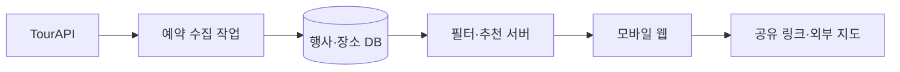

# 주말픽 — 국내 나들이·축제 추천 서비스 계획

> 보관 문서: 2026-09-11 인스타그램 중심으로 방향을 전환했다. 현재 개발·운영 계획은 [PLAN.md](PLAN.md)를 따른다. 아래는 기존 웹 서비스 기획이다.

작성일: 2026-09-11

상태: 2026-09-11에 미리보기 MVP와 Neon·TourAPI 연결 코드를 구현했다. 실제 계정·API 키 연결과 사용자 검증은 진행 전이다. 구체적인 구현 범위·실행법·수집 제한은 README.md를 기준으로 한다. 아래 일정과 수치 목표는 최초 기획 가설을 보존한 것이다.

## 1. 만들 서비스

**날짜와 지역을 고르면, 그날 열리는 행사 3개와 함께 들를 만한 주변 장소를 골라주는 모바일 웹.**

- 가칭: 주말픽.
- 첫 사용자: 주말 약속 장소를 정하는 수도권의 커플·친구 모임.
- 해결할 문제: 행사 날짜, 위치, 비용, 주변 방문지를 여러 페이지에서 찾아보고 일정을 정하는 수고.
- 제품 약속: 1분 안에 갈 곳 후보를 정하고 동행에게 공유한다.
- 초기 지역: 서울·경기·인천. 데이터 검증 결과에 따라 정보가 충분한 지역부터 공개한다.
- 개발 전제: 1인 개발, 약 15작업일. API 운영 승인 대기와 사용자 모집 기간은 별도 변수다.

예시 흐름: `이번 토요일 → 경기 수원 → 전시·문화 → 추천 행사 3개 → 행사 하나 선택 → 주변 방문지 선택 → 공유 / 길찾기`.

## 2. 기사에서 가져온 판단과 확인된 사실

기사는 API 선택 기준으로 데이터의 깊이, 추가 가공량, 이용 조건을 강조한다. 이 계획에서는 공개된 행사 데이터로 날짜와 지역에 맞는 후보를 만들고, 비교와 공유 경험에 개발을 집중한다.

한국관광공사 국문 관광정보 서비스는 행사·지역·위치·상세·이미지 정보와 관광정보 동기화 목록 등을 제공한다. 공공데이터포털에는 무료, 개발 자동승인, 운영 심의승인, 개발계정 트래픽 1,000으로 안내되어 있다. 본문의 일반 데이터 이용허락과 별도로 사진은 공공누리 1·3유형 안내가 있으므로 개별 이미지의 조건을 반영한다.

출처:
- [요즘IT 원문: 지금 당장 서비스에 쓸만한 API ②](https://yozm.wishket.com/magazine/detail/3920/)
- [공식 TourAPI 데이터·이용 조건 안내](https://www.data.go.kr/data/15101578/openapi.do)

이번 확인은 기사 본문과 공식 안내 문서 열람까지다. 키 발급, 인증된 API 호출, 응답 필드의 충실도 검증은 아직 수행하지 않았다. 실제 엔드포인트·필드·호출 한도는 개발 첫 단계에서 발급 계정과 최신 활용명세로 확정한다.

## 3. MVP 기능과 화면

| 화면 | 사용자 행동 | 완료 조건 |
|---|---|---|
| 시작 | 이번 주말/날짜, 방문 지역, 관심사 선택 | 가입 없이 추천 결과에 도달한다. 관심사는 생략할 수 있다. |
| 추천 | 우선 추천 3개 비교, 다른 후보 보기 | 날짜·지역·요금 안내·추천 이유가 보이고 실제 제공 데이터에 근거한다. |
| 행사 상세 | 소개, 일정, 장소, 출처 확인 | 공식 홈페이지와 확인 시점을 제공한다. 미확인 비용·시간은 명확하게 표시한다. |
| 함께 가기 | 주변 장소 최대 2개를 선택·교체 | 행사와 방문 후보의 순서를 간단하게 정할 수 있다. |
| 저장·공유 | 후보 저장, 읽기 전용 링크 공유, 지도에서 길찾기 | 저장 목록은 같은 브라우저에서 유지되고 공유 링크는 다른 기기에서 열린다. |

초기 지역은 사용자가 직접 선택한다. 브라우저 위치 권한은 핵심 흐름의 필수 조건으로 두지 않는다. 거리 정렬을 추가할 때는 현재 위치 사용을 선택 기능으로 제공한다.

주변 장소는 TourAPI 관광지·문화시설 등을 우선 사용한다. 코스에는 원문에서 확인된 운영시간을 표시하며, 시간이 불명확한 장소를 포함한 조합은 방문 후보로 안내한다. 자동으로 방문 시각을 확정하지 않는다.

**후속 단계 기능:** 전국 확대, 계정 간 저장 동기화, 주말 알림, 반려동물·아이 동반 조건, 날씨 연계, 정밀 경로·이동시간, 예약·결제, 리뷰, AI 설명. 동반 조건은 관련 필드의 실제 데이터 충실도를 확인한 뒤 추가한다.

## 4. 데이터 검증을 먼저 한다

처음 2작업일에 API 활용신청과 다음 검증을 수행한다.

1. 다음 4주간 수도권 행사 표본 30건 확보를 시도한다. 적으면 지역·날짜별 실제 공급량을 기록한다.
2. 행사 식별자, 명칭, 시작·종료일, 주소·좌표, 소개, 공식 링크, 요금·운영시간, 이미지·이용 조건을 확인한다.
3. 필수 정보는 식별자·명칭·날짜·위치를 기준으로 삼는다. 비용·이미지 누락이 서비스 노출 전체를 막지 않게 한다.
4. 표본 중 행사 10건을 주최 측 페이지와 대조해 일정·위치가 일치하는지 확인한다.
5. 주변 장소 검색 결과를 10개 행사에 붙여 실제로 유용한 조합을 만들 수 있는지 검토한다.

진행 판단용 목표는 표본의 80% 이상에서 핵심 정보 확보, 검증 행사 10건 중 8건 이상 일정·위치 일치다. 통계적 품질 보증이 아닌 초기 작업 기준이다. 목표에 못 미치면 정보가 충분한 지역으로 공개 범위를 줄이고 검증된 행사를 편집 목록으로 운영한다.

## 5. 추천 방식

MVP는 설명 가능한 규칙으로 추천한다.

1. 날짜가 겹치고 선택 지역에 해당하는 행사를 후보로 만든다. 날짜 판정은 한국 시간 기준으로 `행사 시작일 ≤ 선택일 ≤ 행사 종료일`을 적용한다.
2. 공식적으로 취소·종료된 행사와 필수 정보가 없는 항목을 제외한다. 기간이 여러 날이어도 매일 운영되는지는 별도 운영일 정보로 확인한다.
3. 관심사 일치, 일정의 명확성, 정보 충실도 순으로 점수를 준다. 같은 행사 식별자의 중복을 제거한다.
4. 서로 다른 종류의 후보를 섞어 우선 3개를 보여준다. 조건에 맞는 항목이 적으면 실제 개수와 지역·날짜 변경 방법을 안내한다.
5. 좌표가 있는 행사에는 가까운 관광지·문화시설을 찾아 최대 2개 제안한다. 거리를 표시하면 직선거리임을 명시한다.

추천 이유는 `선택한 토요일에 개최`, `전시·문화 관심사와 일치`처럼 실제 조건으로 만든다. 인기·혼잡도·총예산·차량 이동시간 등 확보하지 않은 정보는 추정값으로 생성하지 않는다.

관심사 태그는 API 분류를 우선 사용하고, 초기에 필요한 소수의 편집 태그만 관리한다. 태그별 데이터 근거를 기록한다.

## 6. 기술 구조

확정 스택은 TypeScript + Next.js와 Neon PostgreSQL이다. 사용자의 요청에 따라 Supabase 제안을 Neon으로 변경했다. 웹 화면과 서버 API를 한 프로젝트에 두고, 수집한 관광정보는 관계형 DB에서 조회한다. 날짜·지역 조건과 저장·공유 기능 중심으로 구성한다.

- [Next.js Route Handlers 공식 문서](https://nextjs.org/docs/app/getting-started/route-handlers)
- [Neon Serverless Driver 공식 문서](https://neon.com/docs/serverless/serverless-driver)

### 데이터 수집과 운영

- 수도권·향후 4주 범위부터 수집한다. 목록은 매일 갱신하고 상세는 변경되었거나 새로 발견한 항목을 우선 처리한다.
- 사용자 페이지 요청은 DB와 캐시에서 응답한다. 외부 API 키는 서버 환경변수로 관리한다.
- 목록·상세·주변 장소·재시도를 합쳐 호출량을 계측한다. 최초 예산은 하루 500회 이내로 잡고 발급 계정 한도의 80%에서 수집을 중단한다. 초기 전체 수집도 같은 예산을 적용한다.
- 당장 다가오는 행사부터 재확인한다. 실패한 수집은 재시도 횟수를 제한하고 마지막 정상 데이터를 보존한다.
- 출처의 수정 시각과 우리 서비스의 확인 시각을 구분해 저장한다. 장기간 갱신되지 않은 항목은 추천 우선순위를 낮추거나 숨긴다.
- 이미지별 출처와 이용 조건을 저장하고 그 조건에 맞춰 표시한다. 조건을 확인하기 어려운 이미지는 기본 이미지로 대체한다.

### 최소 데이터 모델

| 데이터 | 주요 내용 |
|---|---|
| events | 외부 식별자, 행사명, 기간, 지역, 좌표, 분류, 소개, 요금 원문, 운영시간 원문, 상태, 출처, 확인 시각 |
| places | 외부 식별자, 장소명, 유형, 주소·좌표, 운영정보, 출처, 확인 시각 |
| media | 이미지 URL, 관련 행사·장소, 제공처, 이용 조건 |
| shared_plans | 추측하기 어려운 공개 ID, 행사·방문지 식별자, 순서, 선택 날짜, 생성일 |
| sync_runs | 수집 범위, 시작·완료 시각, 호출 수, 성공·오류, 재시도 정보 |

개인 저장 목록은 localStorage로 시작한다. 공유 링크는 사용자가 공유를 눌렀을 때 서버에 생성하며, 위치·이름 같은 개인정보를 포함하지 않는다. 공개 API가 받는 값은 행사·장소 식별자와 허용된 날짜·순서로 제한하고 공유 링크 생성에는 요청 제한을 적용한다.

## 7. 개발 순서와 산출물

| 작업일 | 작업 | 확인 가능한 결과 |
|---|---|---|
| 1–2일 | API 신청·표본 검증, 사용자 5명에게 최근 나들이 계획 과정 확인 | 데이터 품질표, 공개할 지역, 핵심 사용자 문제 확정 |
| 3–5일 | 프로젝트·DB·수집 작업, 날짜·지역 조회 API | 실제 행사 목록이 DB에서 화면에 표시됨 |
| 6–8일 | 모바일 시작·추천·상세 화면, 추천 규칙 | 조건 선택부터 행사 선택까지 완주 가능 |
| 9–10일 | 주변 방문지, 저장, 공유, 지도 링크 | 다른 기기로 공유한 계획을 열고 길찾기로 이동 가능 |
| 11–12일 | 실패·누락 대응, 데이터 출처 표시, 핵심 테스트, 베타 배포 준비 | 아래 출시 완료 조건 통과, 운영 신청에 쓸 활용 화면 확보 |
| 13–15일 | 테스터 10–20명에게 사용 관찰, 오류·추천 개선 | 완료율·저장·공유·길찾기 수치와 다음 개선 항목 확보 |

운영계정 신청은 활용 화면이 준비되는 시점에 진행한다. 공개 운영 일정은 심의 결과와 실제 트래픽 조건을 반영한다. 이 계획 단계에서는 계정 신청·배포·사용자 연락을 실행하지 않는다.

## 8. 출시 완료 조건

- 모바일에서 가입 없이 날짜·지역 선택 → 추천 → 상세 → 공유까지 완료한다.
- 한국 시간의 주말 계산, 날짜 경계, 기간이 겹치는 행사, 종료·취소 행사 처리가 테스트를 통과한다.
- 추천과 공유 링크의 행사·장소가 실제 데이터 식별자와 일치한다. 없는 ID와 유효하지 않은 날짜를 처리한다.
- 실제 표본으로 DB 조회, 추천, 다른 기기에서 공유 링크 열기까지 확인한다.
- 검색 결과 없음, 요금·이미지·시간 누락, 외부 API 장애, 호출량 제한 상태에서 화면이 동작한다.
- 저장 후 새로고침해도 같은 브라우저에서 목록이 유지된다.
- 출처 링크·최종 확인 시각이 보이고 API 키가 클라이언트 코드나 응답에 노출되지 않는다.
- 공유 페이지를 다시 열었을 때 종료·변경된 행사 상태를 표시한다.
- 수집 호출량·오류·마지막 성공 시각을 확인할 수 있다.

## 9. 초기 검증과 수익화 가설

첫 검증은 “추천 결과를 보고 실제로 갈 후보를 정하는가”다. 베타 테스터에게 조건 선택 후 후보 하나를 골라 동행에게 공유하는 과제를 준다.

제안하는 초기 판단 기준:

- 테스터 10명 중 7명 이상이 도움 없이 1분 안에 후보를 선택한다.
- 추천 결과를 본 테스터 10명 중 3명 이상이 저장·공유·길찾기 중 하나를 사용한다.
- 어떤 정보가 부족해서 결정을 못 했는지 사례를 수집한다.
- 2주 연속 사용이 가능해지면 주말 재방문을 별도로 측정한다. 소규모 베타 수치를 시장 수요의 확정적 증거로 해석하지 않는다.

유입 실험은 실제 데이터를 사용한 지역·날짜별 공개 페이지와 공유 링크를 중심으로 한다. 예: `이번 주말 수원 행사`. 날짜가 지난 페이지는 종료 상태와 최신 주말 탐색 경로를 제공한다.

수익화는 사용성이 검증된 뒤 지역 행사·체험 사업자의 유료 소개와 제휴 전환을 시험한다. 유료 소개는 표시를 구분한다. 초기 MVP에는 결제를 넣지 않으며 실제 문의·전환으로 지불 의사를 확인한 뒤 상품과 가격을 정한다.

다음 실행 단위는 API 키 준비, 행사 표본 검증, 첫 지역 확정이다. 이 결과가 확보되면 실제 데이터로 추천 목록 한 화면을 먼저 완성한다.
